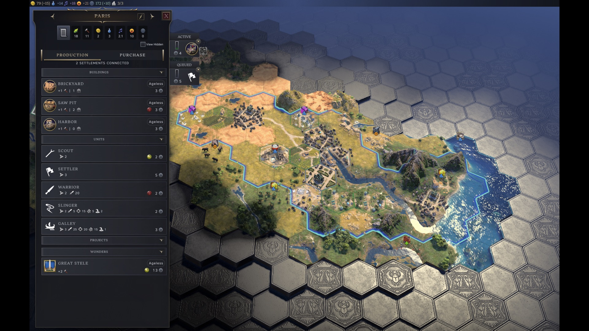

# Connected Settlements

A small, save-safe UI mod for **Sid Meier's Civilization VII** (build 1.4.0+) that
shows **how many settlements are connected** to the selected city or town, right
where you're already looking when you manage it.

The count is injected into the left-hand **Production / Purchase** panel — the
same panel where you pick a town's specialization — so you can see your trade
network reach without opening a separate screen. (An alternate build places the
same information in the right-hand City Details panel; see *Alternate
placement* below.)

UI-only: it reads game state and never changes rules, so it does **not** affect
saved games and is multiplayer-friendly.



## Inspiration & credit

This mod was directly inspired by **City Hall** by *beezany / bszonye*
([civ7-city-hall](https://forums.civfanatics.com/resources/city-hall.31946/) ·
[GitHub](https://github.com/bszonye/civ7-city-hall)). City Hall's
`panel-city-details` and `panel-production-chooser` decorators were the
reference implementation that taught us the connected-settlements API
(`city.getConnectedCities()`), the `Controls.decorate()` pattern, and the
correct decorator lifecycle. If you enjoy this mod, go install City Hall — it's
a far more comprehensive city-management overhaul, and this little mod is a
focused tribute to one slice of what it does.

## Installation (players)

Subscribe on the Steam Workshop. The mod appears under **Additional Content /
Mods** as *Connected Settlements*; enable it and start or load a game. Select a
city or town and open its production panel — the connection count sits near the
top.

## What it shows

- **"N Settlements Connected"** for the selected settlement.
- A freshly founded city with no trade connections shows **"0 Settlements
  Connected"** — that's intentional, so you can tell the mod is active rather
  than silently broken.

---

## For modders: development setup

The repo is a plain UI mod — no build step. Files are synced into the local Civ
VII Mods directory and the game loads them as ES modules.

```
scripts/
  install_local.sh            # rsync the mod into ~/Library/Application Support/Civilization VII/Mods/
  retest.sh                   # quit Civ, sync, clear the mod cache (add --launch to relaunch)
  tail_log.sh                 # show this mod's diagnostic lines from UI.log (add -f to follow)
  prepare_workshop_upload.sh  # stage + (optionally) publish to the Workshop via steamcmd
```

Typical loop while iterating:

```bash
# edit ui/*.js, then:
scripts/retest.sh        # quits the game, syncs files, clears Mods.sqlite
# relaunch Civ VII yourself, reproduce, then:
scripts/tail_log.sh
```

### Layout

```
connected-settlements.modinfo          # mod manifest (UI-only, scope="game")
ui/cs-connections-model.js             # data layer: getConnectedSettlements(city)
ui/cs-panel-production-chooser.js      # ACTIVE: injects the count into the production panel
ui/cs-panel-city-details.js            # ALTERNATE: injects into the City Details panel
text/en_us/InGameText.xml              # in-game strings (LOC_CS_*)
text/en_us/ModInfoText.xml             # mod name/description (browser)
upload/steam/                          # Workshop metadata + staging inputs
```

### Verified game APIs

Confirmed against the base game and City Hall (`bszonye/civ7-city-hall` v2.6.9):

- `city.getConnectedCities()` → array of connected settlement `ComponentID`s.
- `Cities.get(id)` → city object (`.id`, `.name`, `.isTown`, `.Growth?.growthType`).
- `Controls.decorate(panelName, factory)` → supported way to extend a panel.
- `UI.Player.getHeadSelectedCity()` / `UI.Player.selectCity(id)`.

### Alternate placement

`connected-settlements.modinfo` loads **one** decorator. To move the count from
the production panel to the City Details panel, swap the `<Item>` under
`<UIScripts>`:

```xml
<!-- production panel (default) -->
<Item>ui/cs-panel-production-chooser.js</Item>
<!-- OR city details panel -->
<Item>ui/cs-panel-city-details.js</Item>
```

---

## Lessons learned: Civ VII UI modding gotchas

These cost us real debugging time. Documented here so the next modder (and
future us) doesn't repeat them.

### 1. Decorators MUST implement the full lifecycle, or the game crashes

`Controls.decorate("panel-name", (component) => new MyDecorator(component))`
registers a decorator. The engine
(`core/ui/component-support.js` → `doAttach` / `doDetach`) calls **four**
methods on every decorator instance, unconditionally:

```
beforeAttach()   afterAttach()   beforeDetach()   afterDetach()
```

If your class doesn't define them you get, on the next panel detach (e.g. when
you deselect a city or switch interface mode):

```
TypeError: d.beforeDetach is not a function
```

…which aborts the view switch and can **hang the whole game** (stuck on the
loading / begin-game screen). Always define all four, even if some are empty:

```js
beforeAttach() {}
afterAttach()  { /* inject your DOM here — the panel is rendered by now */ }
beforeDetach() { /* remove your DOM here */ }
afterDetach()  {}
```

`afterAttach` / `beforeDetach` are the natural inject/cleanup hooks. For
per-city refreshes without a full re-attach (the prev/next-city arrows reuse the
same panel instance), wrap a prototype method the panel calls on every city
change — e.g. `panel-production-chooser`'s `updateCityName(city)`.

### 2. Civ VII caches the per-mod script list in `Mods.sqlite`

When you change **which** scripts a modinfo loads (add/remove/rename a
`<UIScript>` `<Item>`), a plain restart often keeps serving the *old* cached
script set. Symptom: your new file's top-level code never runs (no logs at all),
or an old file keeps running after you "removed" it.

Fix: delete the cache before relaunching:

```
~/Library/Application Support/Civilization VII/Mods.sqlite
```

`scripts/retest.sh` does this automatically. (Editing the *contents* of an
already-listed file is picked up fine; it's the script *list* that's cached.)

### 3. A subscribed Workshop copy collides with your local dev copy

If you're **subscribed** to your own published mod *and* have a local dev copy
in the Mods folder, **both load** — they share the same `Mod id`, so they
collide and the stale Workshop version can win. `Modding.log` shows it plainly:

```
Loading Mod - .../steamapps/workshop/content/<appid>/<itemid>/...modinfo   ← Workshop (old)
Loading Mod - .../Civilization VII/Mods/<your-mod>/...modinfo               ← local dev
```

This made every local fix appear to do nothing — the game was never running the
code we were editing. **Unsubscribe from the Workshop item while developing
locally**, then re-subscribe after publishing.

### 4. `data-l10n-id` takes a KEY, not a composed string

Setting `el.setAttribute("data-l10n-id", Locale.compose("LOC_X", n))` silently
fails — the localization system then tries to look up the *resolved* string as a
key and finds nothing. For text whose parameters are already substituted, assign
`el.textContent` instead. Use `data-l10n-id` only with a raw `LOC_*` key.

### 5. `<Row>` vs `<Replace>` in localization XML

`<Replace Tag="...">` only updates an entry that already exists. A brand-new key
defined with `<Replace>` is silently dropped. Use `<Row Tag="...">` for new
keys; `<Replace>` only to override base-game text.

### 6. Inject into the panel's scrollable, not its Root

`panelRoot.appendChild(section)` can place your content outside the panel's
visible/scrollable area — it renders off the bottom of the screen. Find the
panel's actual content container and append there. Examples that worked:

- City Details: `#city-details-tab-growth fxs-scrollable`
- Production chooser: append a `data-slot="header"` element to the panel's
  `frame` (mirrors how the base game adds its own `cityStatusContainerElement`).

When unsure of the real container IDs in the current game build, **dump the DOM
at runtime** (`console.error` the panel's child tag/id/class list) rather than
guessing from the unpacked base files — the live structure can differ.

### 7. `console.error` is your log; UI.log is the place to look

`console.error(...)` from a `scope="game"` UIScript shows up in
`~/Library/Application Support/Civilization VII/Logs/UI.log`. `Modding.log` tells
you which modinfo paths loaded. When a script "doesn't run," check whether its
*module-load* line appears at all — if not, it's a load/cache/collision problem,
not a logic bug.

### 8. One bad core-file override can hang the entire game-view load

Mods that override a core engine file via `<ImportFiles>` (e.g.
`core/ui/camera/camera-controller.js`) can break against a new game build. A
`SOURCE ERROR` on such a file halts the game-view JS load — and because the
camera is essential to the map view, the game hangs at "Begin Game" with the map
never opening. Clearing the mod cache (which forces a fresh load of *all* mods)
can suddenly expose a previously-cached-over break in an *unrelated* mod. When
isolating a hang, disable other mods one at a time.

### 9. "Settlement is being razed!" is vanilla, not your mod

That red banner in City Details is base-game UI driven by
`CityDetails.isBeingRazed` (`panel-city-details.js`). A read-only decorator
can't set it. Don't chase it as a mod regression.

---

## Publishing to the Steam Workshop (steamcmd)

```bash
# one-time: store your Steam password in the macOS Keychain
STEAM_USERNAME=<you> scripts/prepare_workshop_upload.sh --store-keychain-password

# stage metadata + content and upload (answers Steam Guard via a dialog)
STEAM_USERNAME=<you> scripts/prepare_workshop_upload.sh --upload-via-keychain
```

Notes from publishing this mod:

- SteamCMD can't be driven from a non-interactive shell — it needs a real TTY
  for the password / Steam Guard prompts. The `--upload-via-keychain` path uses
  an `expect` wrapper (`scripts/steamcmd_upload_with_keychain.expect`) that pulls
  the password from the Keychain and surfaces the Steam Guard prompt in a macOS
  dialog.
- **Preview images can't be uploaded via steamcmd** for this app (it uses the
  newer UGC storage, not legacy cloud). Set the preview manually on the Workshop
  item's Edit page. Stage your image at `upload/steam/preview.png`.
- The first successful upload writes the new `PUBLISHEDFILEID` back into
  `upload/steam/workshop.conf` automatically.

## License & credits

- Author: **childofwight**
- Inspired by and indebted to **City Hall** by *beezany / bszonye*
  (<https://github.com/bszonye/civ7-city-hall>). Independent implementation, not
  derived code.
- Built against Civilization VII game build **1.4.0**.
